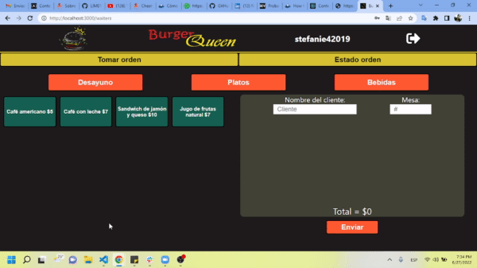
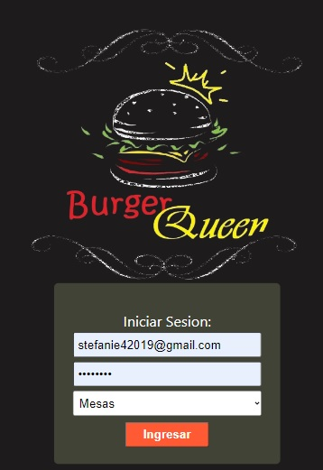
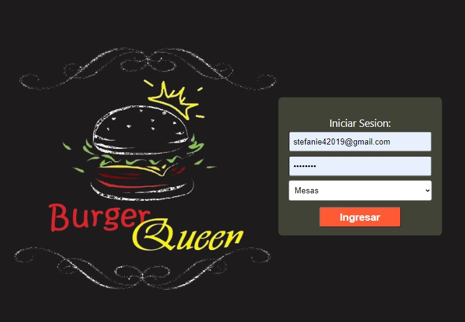
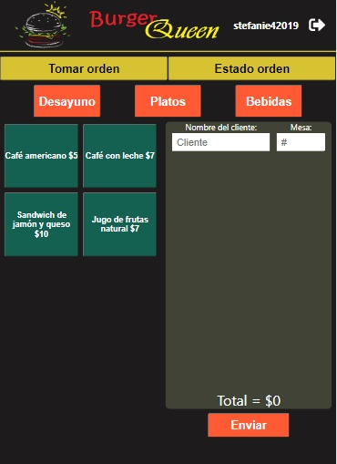
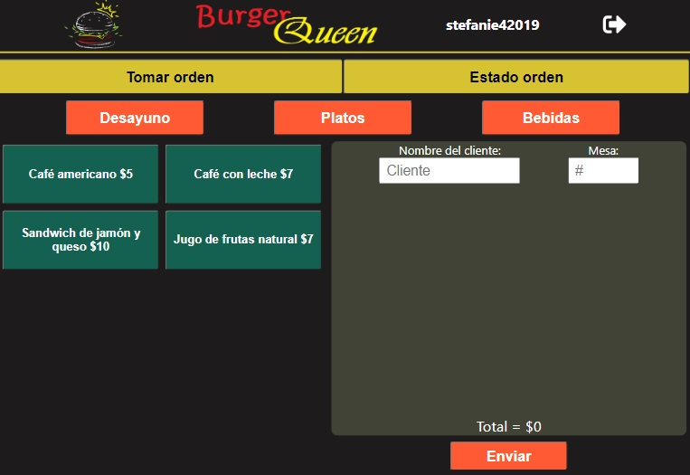
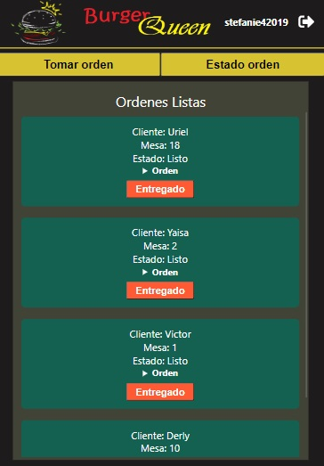
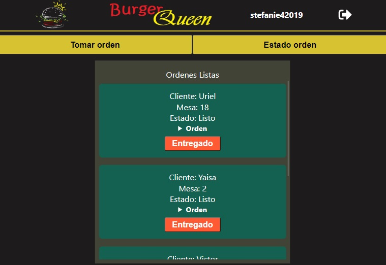
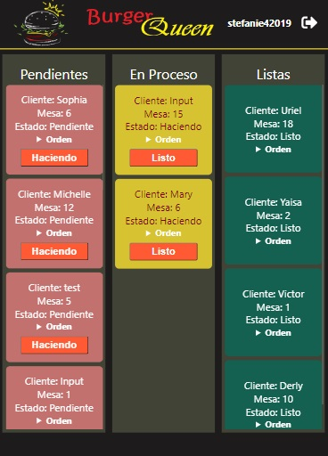
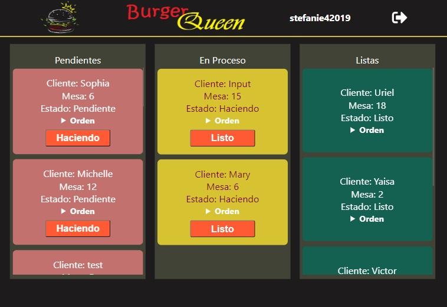

# Burger Queen

  

***

## 2. Resumen del proyecto

Burger Queen es una Progressive Web App desarrollada en React, para uso de
un pequeño restaurante de hamburguesas que está creciendo, cuenta con una
interfaz en la que los trabajadores del restaurante pueden tomar pedidos usando una _tablet_,
ver cuando estos ya esten listos y se entreguen en la mesa correspondiente; asimismo los trabajadores
de cocina pueden visualizar los pedidos enviados y cambiar su estado conforme se vayan atendiendo.

Por pedido del cliente el restaurant cuenta con el siguiente menú:
>
### DESAYUNOS
> | Ítem                      |Precio $|
> |---------------------------|------|
> | Café americano            |    5 |
> | Café con leche            |    7 |
> | Sandwich de jamón y queso |   10 |
> | Jugo de frutas natural              |    7 |
>
### PLATOS
>
> | Ítem                      |Precio|
> |---------------------------|------|
> |Hamburguesa simple         |    10|
> |Hamburguesa doble          |    15|
> |Papas fritas               |     5|
> |Aros de cebolla            |     5|

### BEBIDAS
>
> | Ítem                      |Precio|
> |---------------------------|------|
> |Agua 500ml                 |     5|
> |Agua 750ml                 |     7|
> |Bebida/gaseosa 500ml       |     7|
> |Bebida/gaseosa 750ml       |     10|

La App permite aumentar y disminuir la cantidad de productos y eliminarlos segun las preferencias
del cliente.

La interfaz muestra el menú con todos sus _productos_. El usuario puede ir eligiendo qué _productos_
agregar y la interfaz y estos se irán mostrando en el _resumen del pedido_ con el costo total.

***
#### [Historia de usuario 1] Usuario debe poder iniciar sesión

Yo como usuario quiero iniciar sesión con mi e-mail y contraseña y quiero poder elegir el rol con el que me desempeño.

  
   

***
#### [Historia de usuario 2] Mesero/a debe poder tomar pedido de cliente

Yo como meserx quiero tomar el pedido de un cliente para no depender de mi mala
memoria, para saber cuánto cobrar, y enviarlo a la cocina para evitar errores y
que se puedan ir preparando en orden.

  
   

***
#### [Historia de usuario 3] Mesero/a debe poder ver pedidos listos

Yo como meserx quiero poder visualizar los pedidos que ya estan listos desde la cocina 
para ser entregados al cliente.

  
   

***
#### [Historia de usuario 4] Cocinero debe ver los pedidos

Yo como cocinero quiero ver los pedidos de los clientes en orden y
marcar cuáles están listos para saber qué se debe cocinar y avisar a lxs meserxs
que un pedido está listo para servirlo a un cliente.

  
   

***

### Despliegue

Esta App fue desplegada en Netlify 

Netlify es un servicio para desplegar tu web app - backend y
frontend - y no es limitada a usar solamente con Firebase.
Por ejemplo, puedes desplegar un app MySQL/Express/React.
